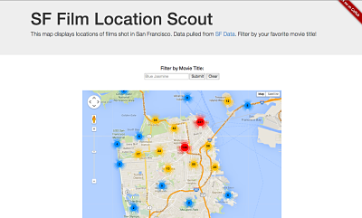
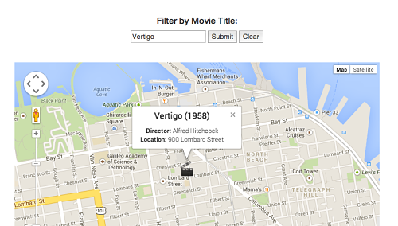

SF Film Location Scout
======================

This web app allows the user to view locations of films shot in San Francisco. The movie data was taken from [SF Data](https://data.sfgov.org/Arts-Culture-and-Recreation-/Film-Locations-in-San-Francisco/yitu-d5am). Users can filter by film title using auto completion search. 

[Live Site: http://mattsauerbach.com/filmLocations/](http://mattsauerbach.com/filmLocations/)

Development Process
-----------
While developing this project I focused on the full stack. My backend acts as an API for the front end to request movie data, which responds with JSON objects. The frontend is Javascript heacy and displays the movies as markers on a Google Map. It also handles film title filtering which in turn queries the backend API.

The backend is written in PHP (`process.php`) and the frontend is Javascript/HTML (`index.html`, `functions.js`). I chose PHP because of my prior web development experience and it would allow for a robust server-side API. I also had to pre-process the movie data which I was confident could be done in PHP. The frontend relies heavily on the Google Maps API, so I used Javascript to take advantage of Google’s library. I created a simple UI using bootstrap. I also take advantage of two Google API’s to pre-process the data.

In hindsight it might have been easier to use a MVC framework, rather than creating my own. My `index.html` page acts as the view and my Javascript acts as the controller. The Javascript takes the user’s input and makes requests to the API (`process.php`). My server-side code acts as the model, as it interacts with the database and provides the frontend with its requested JSON.

### Backend
First, I needed to create a one-time script to pre-process the data. The SF gov data provided the title, year, director and location for all movies shot in SF. In order to display each location on a Google Map I need a longitude and latitude point. This dataset provided location generally as a string. For example, “Golden Gate Park”, “Union Square” or  “20th and Folsom Street”. I needed to write a script to translate these general location points to precise data points. I decided to use the Google Maps Geocode API, which takes an address and returns the longitude and latitude. We know all these films were shot in SF, so I used the city as a bound to help with accuracy. Here’s a sample call: <pre>https://maps.googleapis.com/maps/api/geocode/json?address=20th+folsom+street&bounds=37.775,-122.4183333</pre>

After trying a few locations manually, I noticed it worked well on addresses but not places of interest (i.e: Golden Gate Bridge). I decided if the Geocode API returned null then I would query the Google Places API, which takes places of interest. This worked really well for the non-address locations. Overall, this process worked well, but after viewing the map I noticed markers outside of CA. I took a few extraneous locations and ran them into the Geocode API manually and saw that in fact the API provided with coordinates outside of my desired region. I was curious and decided to append “San Francisco, CA” to the location. To my surprise this found the correct location. After trying a few more, I decided to re-run the script making this appendage to each location. Although I still had a few outliers, this drastically improved the location data.

Initially, I thought I would run this script each time the user loaded my app and store the points on the client side. After a bit of thought and analyzing the Google API rate limits (1,000 per day) I realized it’s more efficient to run this once and store all the data points in a database. Due to my fairly simple tasks of inserting data points and later fetching them, I decided to use a MySQL database. The create schema is located in `table.sql`. I then wrote `database.php` to contain all SQL queries. The pre-processing is finished -- now onto the API! 

I needed an architecture where the frontend JS could request a JSON object of the data points from the backend. I built a callable endpoint that returns films from the database. It takes an optional parameter called title that when provided queries by film title. Try it here: <pre>http://mattsauerbach.com/filmLocations/process.php?function=movies </pre> <pre>http://mattsauerbach.com/filmLocations/process.php?function=movies&mTitle=blue+jasmine </pre>. 

###Frontend
I used Bootstrap to build a simple and clean UI that would allow the user to view the project overview, view film markers on the map and filter by title. When my application loads, I call JS functions `loadMap()` and `loadMovies()`. This loads the map object on the page and then fills the map with all film markers. The user can then interact with the map and view different markers. Since many films were shot in SF the map looked a bit crowded. I decided to take advantage of the Google Maps library called clustering (`clustering.js`). I enable this when filtering is desired.  For simplicity, the user is provided with autocompletion search. I used the JQuery library to accomplish this by calling my API for all movie titles. After the user selects their favorite film the submit button (when clicked) calls the `getMovies()` function and we pass in the film title. The API then returns movies with that title. The JS iterates through each movie and creates a marker. Since filtering is enabled we clear the map (`clearOverlays()`), disable clustering and load the created markers. 

Other
-----------

###Testing
I ran automated tests by using JS to submit difference film titles and checking the response from the server with my correct version of the response. I queried films in my database, as well as malformed titles and films not shot in SF. This allowed me to test that the API produced the right response and that the front and backend were communicating. 

###Improvements 
Overall, I’m proud of this project as it encapsulates many of my skills. Since the task was general I didn’t want to hone in too closely into a specific detail. 
If I were to spend more time I would:
  1. A few films were shot in the same location and therefore have the same lat/long points. Google Maps displays only the top point, which makes it impossible to view other films shot at this location. Others have used methods to precisely scatter identical points to make them all visible.  
  2. Increase efficiently with less backend calls. Anytime the user filters, clears or reloads the map we call the API. It would be better to call the API once and store all the data points locally. Then filter the movies on the frontend and when it’s necessary to reload use the local data rather than calling the backend. 
  3. Improve the UI. Add film posters and IMBD links to info windows.
  4. Add more filters (year, actress, etc…) 
  5. Further improve the pre-process algorithm to better identify coordinates. 

